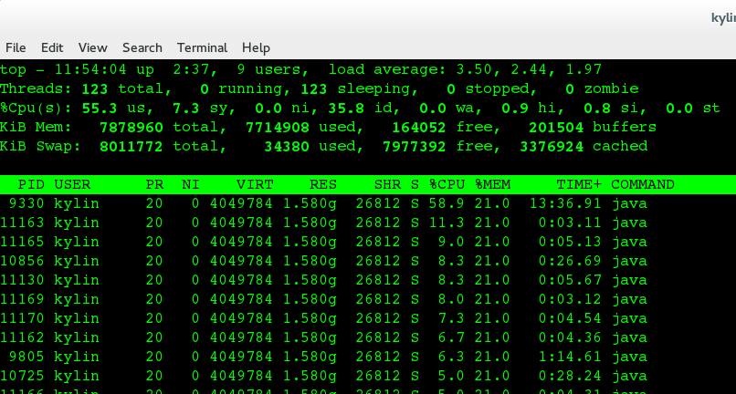

## Issue

Teiid DatabaseAppender JPA perisist Command log consume high CPU.

## Reproduce Steps

* **1** Download and Install DV 6.1

* **2** Deploy portfolio VDB

Use the [quickstart steps](https://github.com/teiid/teiid-quickstarts/tree/master/dynamicvdb-datafederation) depoy portfolio-vdb.xml to DV 6.1

* **3** Enable Command log

Edit standalone.xml add the following lines

~~~
<logger category="org.teiid.COMMAND_LOG">
                <level name="DEBUG"/>
                <handlers>
                    <handler name="TEIID_COMMAND_LOG"/>
                </handlers>
            </logger>
            <logger category="org.teiid.AUDIT_LOG">
                <level name="DEBUG"/>
                <handlers>
                    <handler name="TEIID_AUDIT_LOG"/>
                </handlers>
            </logger>
~~~

before root-logger.

* **4** Run Client

Run [org.teiid.test.client](https://github.com/kylinsoong/teiid-samples/blob/master/teiid-test/src/main/java/org/teiid/test/client/PortfolioPerfClient.java) as Java Application, this will reproduce the issue, one teiid DatabaseAppender thread always consume high cpu as below figure: 

**9330** is teiid DatabaseAppender thread, below thread dumps are collected as a sequence with 1 second time interval

