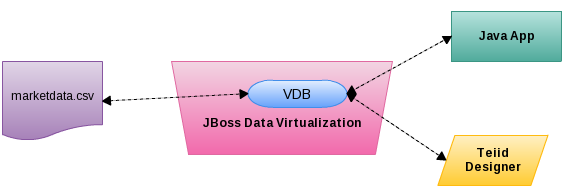
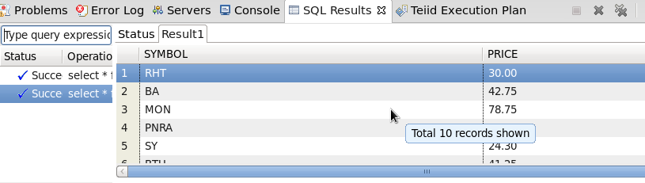

# What's this

In this section we will connect to a flat file in a CSV (Comma Separated Values) format which contains market information. Like [XML DataSource](jdv-xmldatasource.md), we change books.xml to CSV file.

As above figure, the market data be persiste in csv file [marketdata.csv](../workspace/CSVDataSource/marketdata.csv), we can access these data via JDBC/Teiid Designer if we use JBoss Data Virtualization with VDB.

The procedure almost similar like [XML DataSource](jdv-xmldatasource.md), we only highlight the diffierence in this document.

# Creating a Teiid Project

Create the [CSVDataSource](../workspace/CSVDataSource) Teiid Model Project with Teiid Designer perspective.

# Import Metadata from a CSV file

Right-click on the `sources` folder and select import -> Teiid Designer, select the File Source (Flat) >> Source and View Model to import a data source. Select the `marketdata.csv` from local file system, named `MarketData` in Source Defnition section, and named `MarketData` as table name.

# Preview Data via the Teiid Server

Select the `Table or Procedure`, click the Preview Data, the SQL Results should looks as bellow:

# Virtual Database Creation and Deployment

Create `MarketData_VDB.vdb`, and deploy it to JBoss Data Virtualization Server.

# JDBC access csv data via deployed VDB

Run [CSVDataSourceClient.java](../jdbc-client/src/main/java/com/jboss/teiid/client/CSVDataSourceClient.java) as Java Application will execute JDBC query, the following results output:

~~~
1: RHT, 30.00
2: BA, 42.75
3: MON, 78.75
4: PNRA, 84.97
5: SY, 24.30
6: BTU, 41.25
7: IBM, 80.89
8: DELL, 10.75
9: HPQ, 31.52
10: GE, 16.45
~~~

> Note these data come from [marketdata.csv](../workspace/CSVDataSource/marketdata.csv), the JDBC URL like

~~~
jdbc:teiid:MarketData_VDB@mm://localhost:31000;version=1
~~~

The query SQL looks like

~~~
SELECT * FROM ViewModel.MarketData
~~~
 
