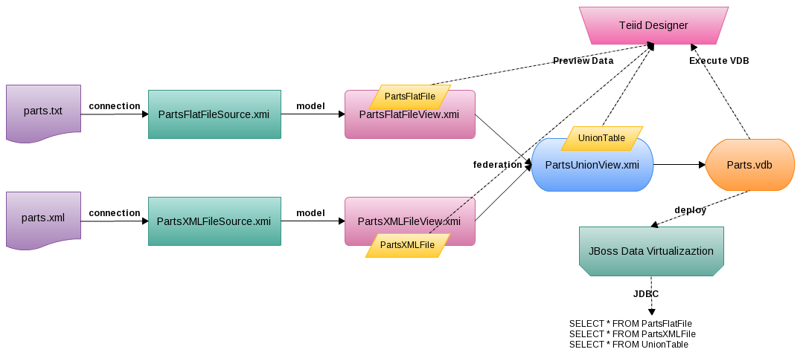
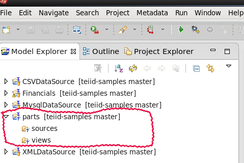
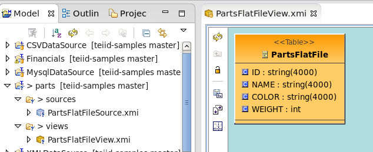
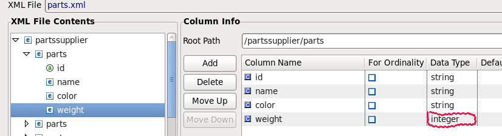
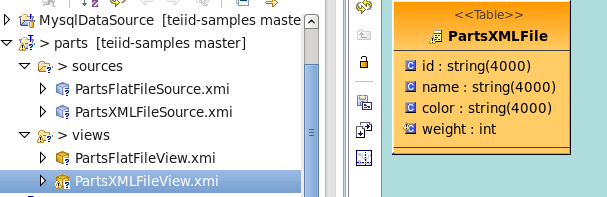
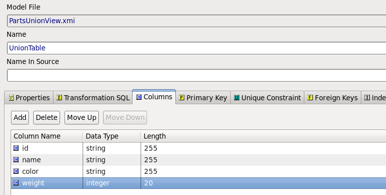
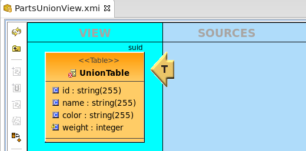
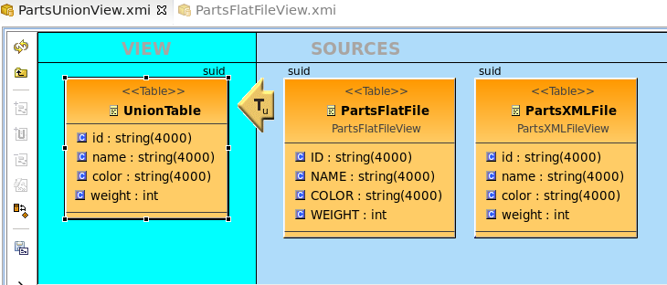
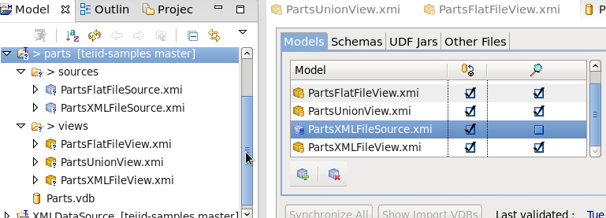

# Example of Federating Two Data Sources

The Content contain:

* Overview
* Requirements
* Preparing the Data
* Creating the Project
* Import Metadata from a Flat file
* Import Metadata from a XML file
* Create a Union View Model
* Test the New Model

# Overview

This article presents the ability of Teiid Designer to provide a federated view of two independent data sources. Specifically, it outlines taking an XML file and a text file, creating source models from them and fusing them together in a single union view model.

As below figure

* `parts.txt` and `parts.xml` contain different data
* `parts.txt` be connected by `PartsFlatFileSource.xmi` and modeled by `PartsFlatFileView.xmi`
* `parts.xml` be connected by `PartsXMLFileSource.xmi` and modeled by `PartsXMLFileView.xmi`
* `PartsUnionView.xmi` federating both `PartsFlatFileView.xmi` and `PartsXMLFileView.xmi`
* `Parts.vdb` created base on `PartsUnionView.xmi`, it can be deploy to JBoss Data Virtualization
* Teiid Designer used to Design connection, Design Model, Preview Data, Execute VDB, etc
* JDBC query against JBoss Data Virtualization Server

# Requirements

* JBoss Data Virtualization 6.x installed and configured correctly, refer to [document](jdv-installation.md) for details
* JBoss Developer Studio 7.x with JBoss Data Virtualization Development Tools installed and configured correctly, refer to [document](jdv-installation.md) for details

# Preparing the Data

The data sources to be fused consist of the following:

* [parts.txt](parts.txt)
* [parts.xml](parts.xml)

The files should be copied to a location where both are accessible by the Teiid installation, eg. /usr/share/teiid. Should the teiid installation be located on another host then the files should also be copied to the same location on that host as well since the final deployed VDB does not carry the data with it.

# Creating the Project

Open the Teiid Designer perspective in JBoss Developer Studio.

* File -> New -> Other -> Teiid Designer -> Teiid Model Project
* Enter the project name as `parts` and choose a location for the project
* Click **Next>** and if the Project References page is displayed, click **Next>** again (No projects need referencing)
* In the **Model Project Options** page, only leave selected the `source` and `views` folders then click **Finish**

# Import Metadata from a Flat file

* `Import` -> `File Source (Flat) >> Source and View Model`, click **Next>**, enable `Flat file on local file system` in Import From Flat File Source wizard, click **Next>**
* In Data File Source Selection page, new Data File Source with name `PartsFlatFileSource` and point to [parts.txt](parts.txt)
* Also in Data File Source Selection page, Source Model Definition section, select Localtion to `sources` folder and name `PartsFlatFileSource`, then click **Next>**
* In Flat File Delimited Columns Parser Setting page, change `WEIGHT` column to interger, then click **Next>**
* In View Model Definition page, select Location `parts/views`, Name `PartsFlatFileView.xmi`, New view table name `PartsFlatFile`, and click **Finish**

# Import Metadata from a XML file

* `Import` -> `File Source (XML) >> Source and View Model`, click **Next>**, enable `XML file on local file system` in Import From Flat File Source wizard, click **Next>**
* In XML Data File Source Selection page, new Data File Source with name `PartsXMLFileSource` and point to [parts.xml](parts.xml)
* Also in XML Data File Source Selection page, Source Model Definition section, select Localtion to `sources` folder and name `PartsXMLFileSource`, then click **Next>**
* In XML Data File Import Options page, select Root Path `/partssupplier/parts`, and add column, change the `WEIGHT` column to interger

* Click **Next>**, in View Model Definition page, select Location `parts/views`, Name `PartsXMLFileView.xmi`, New view table name `PartsXMLFile`, and click **Finish**

# Create a Union View Model

### Create Relational View Model

* Right-click on the **views** folder, select **New > Teiid Metadata Model** to open the **New Model Wizard**

* In the **New Model Wizard**, enter the following and click **Finish**
** Location: parts/views
** Model Name: PartsUnionView
** Model Class: Relational
** Model Type: View Model

This should create a blank **PartsUnionView Model** Editor.

### Create View Table

* In the blank **PartsUnionView** Model Editor,  right-click and select **New Child > Table**

* In prompted **Create Relational View Table** wizard enter the name **UnionTable**, Define Columns as below figure then click **OK**.

### Add Source Tables to View Transformation

The view is now ready to be linked to the text and xml source models. This is achieved by opening the **Transformation Diagram** for the **PartUnionView** model.

* In the **Model Explorer View**, expand the **PartUnionView** node and double-click the **UnionTable**. The transformation diagram editor should be opened:

* In the **Model Explorer**, selecting the **PartsFlatFile** and **PartsXMLFile** enables the **Add Union Transformation Source(s)** button on the diagram toolbar. Click this button to add the two views as sources for the **UnionTable** as below:

# Test the New Model 

* Create VDB, Select Model **PartsUnionView**, the source and other views models will be added automatically as dependency models, as below:

* Deploy `Parts.vdb`, Run [PartsClient](../jdbc-client/src/main/java/com/jboss/teiid/client/PartsClient.java) as java Application, this will have the following output:

~~~
Query SQL: SELECT * FROM PartsFlatFile
1: P300, Nut, Red, 12
2: P301, Bolt, Blue, 12
3: P302, Screw, Blue, 13
4: P303, Bolt, Green, 17
5: P304, Cam, Green, 18
6: P305, Cog, Red, 20
7: P306, Screw, Blue, 16
8: P307, Washer, Green, 19
9: P308, Cam, Yellow, 15
10: P309, Rod, Yellow, 14
11: P310, Cap, Red, 13
12: P311, Wheel, Green, 18
13: P312, Bolt, Blue, 21
14: P313, Nut, Blue, 11
15: P314, Screw, Yellow, 15
16: P315, Fastener, Blue, 14

Query SQL: SELECT * FROM PartsXMLFile
1: P400, Rod, Red, 12
2: P401, Bolt, Orange, 12
3: P402, Nail, Orange, 13
4: P403, Bolt, Green, 17
5: P404, Cam, Green, 18
6: P405, Cog, Red, 20
7: P406, Nail, Orange, 16
8: P407, Washer, Green, 19
9: P408, Cam, Black, 15
10: P409, Rod, Black, 14
11: P410, Cap, Red, 13
12: P411, Wheel, Green, 18
13: P412, Bolt, Orange, 21
14: P413, Rod, Orange, 11
15: P414, Nail, Black, 15
16: P415, Fastener, Orange, 14

Query SQL: SELECT * FROM UnionTable
1: P300, Nut, Red, 12
2: P301, Bolt, Blue, 12
3: P302, Screw, Blue, 13
4: P303, Bolt, Green, 17
5: P304, Cam, Green, 18
6: P305, Cog, Red, 20
7: P306, Screw, Blue, 16
8: P307, Washer, Green, 19
9: P308, Cam, Yellow, 15
10: P309, Rod, Yellow, 14
11: P310, Cap, Red, 13
12: P311, Wheel, Green, 18
13: P312, Bolt, Blue, 21
14: P313, Nut, Blue, 11
15: P314, Screw, Yellow, 15
16: P315, Fastener, Blue, 14
17: P400, Rod, Red, 12
18: P401, Bolt, Orange, 12
19: P402, Nail, Orange, 13
20: P403, Bolt, Green, 17
21: P404, Cam, Green, 18
22: P405, Cog, Red, 20
23: P406, Nail, Orange, 16
24: P407, Washer, Green, 19
25: P408, Cam, Black, 15
26: P409, Rod, Black, 14
27: P410, Cap, Red, 13
28: P411, Wheel, Green, 18
29: P412, Bolt, Orange, 21
30: P413, Rod, Orange, 11
31: P414, Nail, Black, 15
32: P415, Fastener, Orange, 14
~~~

> Note, from above output, the union view returns the data from two independent data sources. The reference project as [workspace/parts](../workspace/parts).
