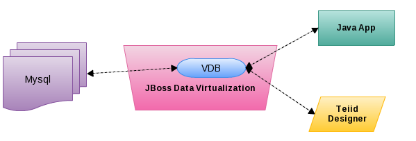
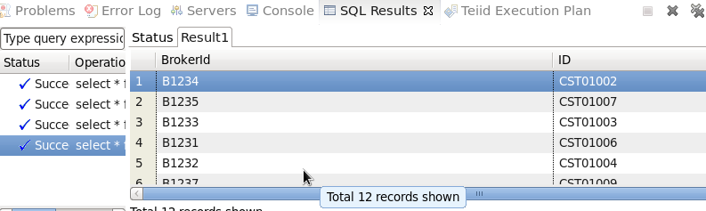
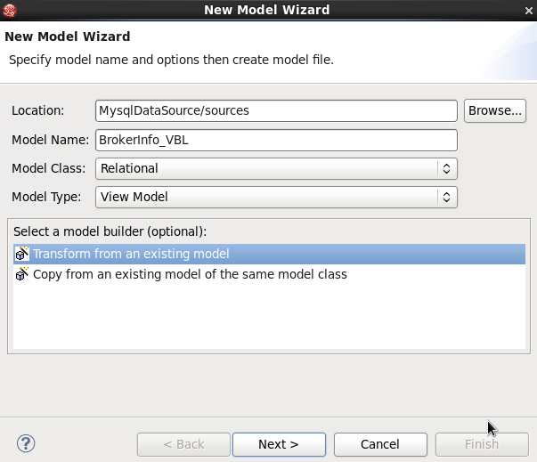

# What's this?

This document show import mettadata from Mysql database, create & deploy virtual database and use JDBC interact with VDB.

As above figure, Mysql database `brokerinfo` contain 2 tables `Broker` and `Customer` as document [Mysql Samples BrokerInfo](mysql-samples-brokerinfo.md) depicted. Using JBoss Data Virtualization & VDB we can interact/access mysql database data either Teiid JDBC, or Teiid Designer.

# Creating a Teiid Project

In this section, we create Teiid Project [MysqlDataSource](../workspace/MysqlDataSource).

# Import Metadata from Mysql

Select `JDBC Database >> Source Model` to start Import Metadata from Mysql, in connection profile wizard select `brokerinfo` as database name, `jdv_user` as user, `jdv_pass` ass password.

# Preview Data via the Teiid Server

Select the Table or Procedure, click the Preview Data, the SQL Results should looks as bellow:

The above show we preview data in `Customer` table, note that total have 12 lines.

# Create a virtual base layer

A virtual base layer means data services abstraction layer is to provide a level of isolation from the physical sources themselves.

Select `New -> Teiid Metadata Model`, Enter BrokerInfo_VBL as the Model Name, Relational as the Model Class, and View Model as the Model Type. Select `Transform from an existing model` in the Select a model builder panel as below figure:

Click `Next` to continue, select the exist Model.

# Virtual Database Creation and Deployment

Create VDB `BrokerInfo_VDB` and deploy it to JBoss Data Virtulization.

# JDBC access mysql data via deployed VDB

Run [MySqlDataSourceClient](../jdbc-client/src/main/java/com/jboss/teiid/client/MySqlDataSourceClient.java) will show how VDB be used for query data base.

