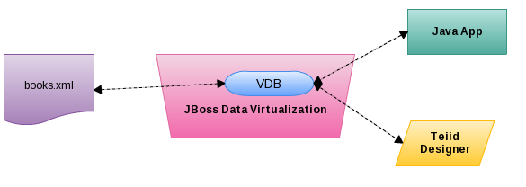
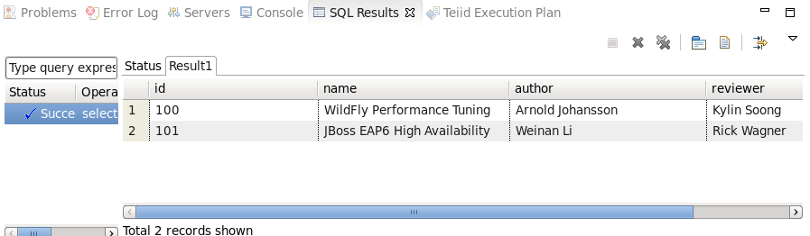

# What's this

This document show import mettadata from xml file, create & deploy virtual database and use JDBC interact with xml file. 

As above figure depicted, [book.xml](../workspace/XMLDataSource/books.xml) contain a series books, throw JBoss Data Virtualization & VDB we can interact/access xml data via either JDBC, or Teiid Designer.

The content containing:

* Start JDV Server and Set up Teiid instance
* Creating a Teiid Project
* Import Metadata from a XML file 
* Preview Data via the Teiid Server
* Virtual Database Creation and Deployment
* JDBC access xml data via deployed VDB

# Start JDV Server and Set up Teiid instance

To open the “Teiid Designer” perspective, first select Window → Open Perspective → Other… in order for the full list of perspectives to be displayed and the “Teiid Designer” perspective to be selectable.

Start JDV Server, make sure the Test JDBC connection return `OK` as following figure:

# Creating a Teiid Project

To create the project, from the menu bar on JBDS, select File → New → Teiid Model Project, enter the project name `XMLDataSource`, select default setting for conpleting the Teiid Project Creation.

# Import Metadata from a XML file

Right-click on the `sources` folder and select import -> Teiid Designer, this time you will select the File Source (XML) >> Source and View Model to import a data source. Select the books.xml from local file system, named `BooksModel` in Source Defnition section, and named `Books` as table name.

# Preview Data via the Teiid Server

Select the `Table or Procedure`, click the *Preview Data*, the SQL Results should looks as bellow:

# Virtual Database Creation and Deployment

Select New → Teiid VDB can start to create VDB, fill the VDB name, for exanple `Books_VDB`, and add the Model which we create in previous step, this will generate `Books_VDB.vdb`.

Deploy VDB via Right Click VDB -> Modeling -> Deploy.

# JDBC access xml data via deployed VDB

Run [XMLDataSourceClient.java](../jdbc-client/src/main/java/com/jboss/teiid/client/XMLDataSourceClient.java) as Java Application will execute JDBC query, the following results output:

~~~
1: 100, WildFly Performance Tuning, Arnold Johansson, Kylin Soong
2: 101, JBoss EAP6 High Availability, Weinan Li, Rick Wagner
~~~

The JDBC connection parameters like below:

~~~
	private static final String JDBC_DRIVER = "org.teiid.jdbc.TeiidDriver";
	private static final String JDBC_URL = "jdbc:teiid:Books_VDB@mm://localhost:31000;version=1";
	private static final String JDBC_USER = "user";
	private static final String JDBC_PASS = "user";
~~~

The Query SQL like:

~~~
SELECT * FROM ViewModel.Books
~~~

