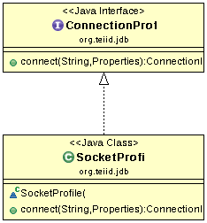

## SocketProfile

The java.sql.DriverManager class uses this class to connect to Teiid Server.

## SocketServerConnection

SocketServerConnection represents a client connection that maintains session state and allows for service fail over. Implements a sticky random selection policy.

## SocketServerConnectionFactory

SocketServerConnectionFactory responsible for creating socket based connections. The common approach is object based and layered. Connections manage failover and identity. ServerInstances represent the service layer to a particular cluster member.  ObjectChannels abstract the underlying IO.

