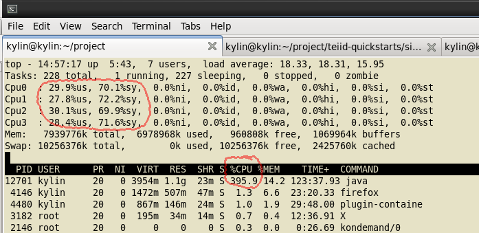
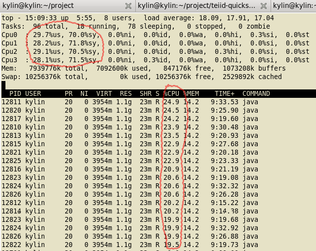

## Issue

JDV hit High CPU issue in sometime while executing VDB deploying, I have met this issue several times, but I think it's not reproduceable.

From System level top commands output snapshot:

> Note that process 12701 is JDV(6.1.0.DR2 in my test) occupy `395.9%` cpu, this hints almost all cpu be used by JDV.

> From top red cycle, `30%` cpu used by application, `70%` cpu used by system call

From CPU Usage capture per threads sanpshot:

> Total 18 threads occupyed all 4 core CPU

From OS aspect strace output:

~~~
% time     seconds  usecs/call     calls    errors syscall
------ ----------- ----------- --------- --------- ----------------
 63.11   27.413387         322     85053           epoll_wait
 28.47   12.367380       24297       509       248 futex
  4.09    1.776725      177673        10        10 restart_syscall
  2.16    0.939288          11     84866           read
  2.16    0.937841          11     84867           write
  0.00    0.000598          18        34         6 stat
  0.00    0.000000           0         1           open
  0.00    0.000000           0         1           close
  0.00    0.000000           0         2           getdents
------ ----------- ----------- --------- --------- ----------------
100.00   43.435219                255343       264 total
~~~ 

> Above strace hints in less then 5 seconds there are lots of system call, 84866 times read, 84867 times write, 85053 times epoll_wait, 509 times futex

Java Thread Dump(collect 3 times with 10 seconds interval):

[tdump.1](tdump.1)
[tdump.2](tdump.2)
[tdump.3](tdump.3)i

## High CPU Threads

~~~
"New I/O worker #3" daemon prio=10 tid=0x00007fc71c0d2000 nid=0x320b runnable [0x00007fc7074f3000]
"New I/O worker #12" daemon prio=10 tid=0x00007fc6fc21c000 nid=0x3214 runnable [0x00007fc706bea000]
"New I/O worker #5" daemon prio=10 tid=0x00007fc71c10e800 nid=0x3211 runnable [0x00007fc706eed000]
"New I/O worker #1" daemon prio=10 tid=0x00007fc6fc12b000 nid=0x320a runnable [0x00007fc7075f4000]
"New I/O worker #6" daemon prio=10 tid=0x00007fc6fc181800 nid=0x320d runnable [0x00007fc7072f1000]
"New I/O worker #8" daemon prio=10 tid=0x00007fc6fc1bf800 nid=0x320f runnable [0x00007fc7070ef000]
"New I/O worker #13" daemon prio=10 tid=0x00007fc71c14c800 nid=0x3215 runnable [0x00007fc706ae9000]
"New I/O worker #17" daemon prio=10 tid=0x00007fc71c1aa000 nid=0x3219 runnable [0x00007fc7066e5000]
"New I/O worker #9" daemon prio=10 tid=0x00007fc6fc1de800 nid=0x3210 runnable [0x00007fc706fee000]
"New I/O worker #16" daemon prio=10 tid=0x00007fc71c18b000 nid=0x3217 runnable [0x00007fc7068e7000]
"New I/O worker #14" daemon prio=10 tid=0x00007fc71c16c000 nid=0x3216 runnable [0x00007fc7069e8000]
"New I/O server boss #15" daemon prio=10 tid=0x00007fc6fc23c800 nid=0x3218 runnable [0x00007fc7067e6000]
"New I/O server boss #18" daemon prio=10 tid=0x00007fc71c1c9000 nid=0x321a runnable [0x00007fc7065e4000]
"New I/O worker #4" daemon prio=10 tid=0x00007fc6fc162800 nid=0x320c runnable [0x00007fc7073f2000]
"New I/O worker #7" daemon prio=10 tid=0x00007fc6fc1a0800 nid=0x320e runnable [0x00007fc7071f0000]
~~~

[Complete Thread dump](highcpu-threads)
